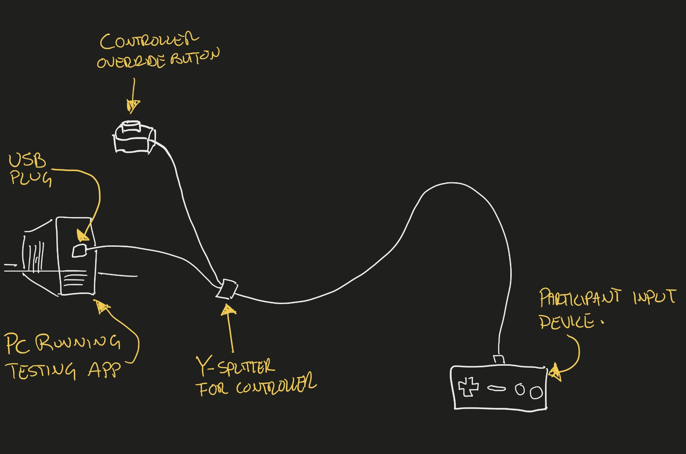
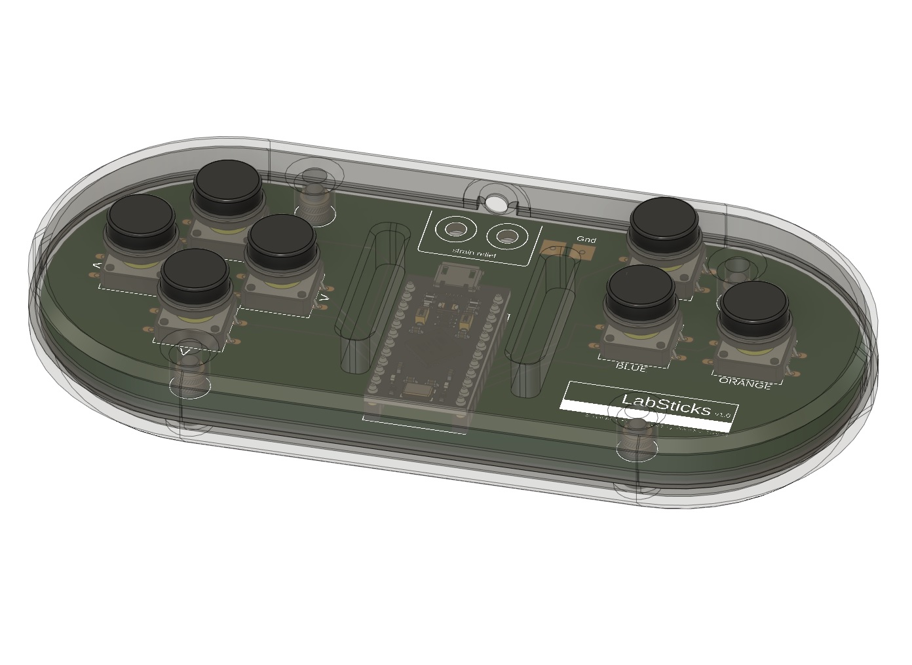
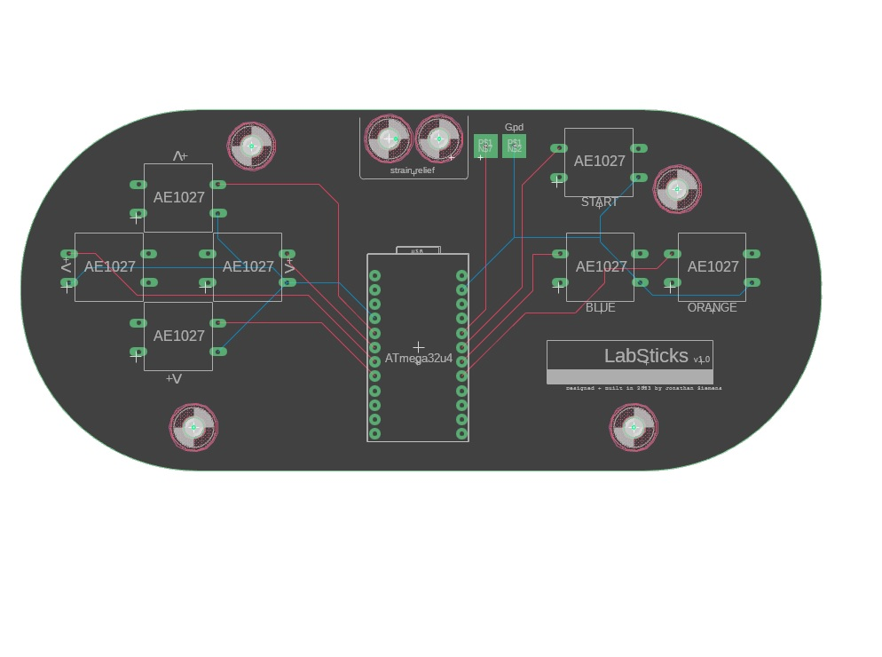
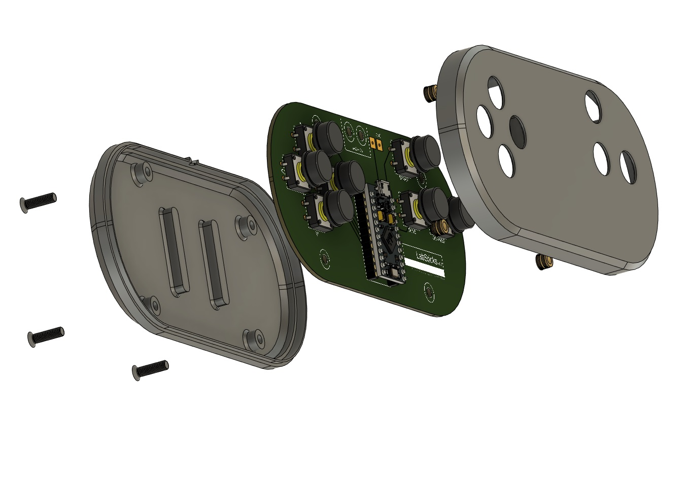
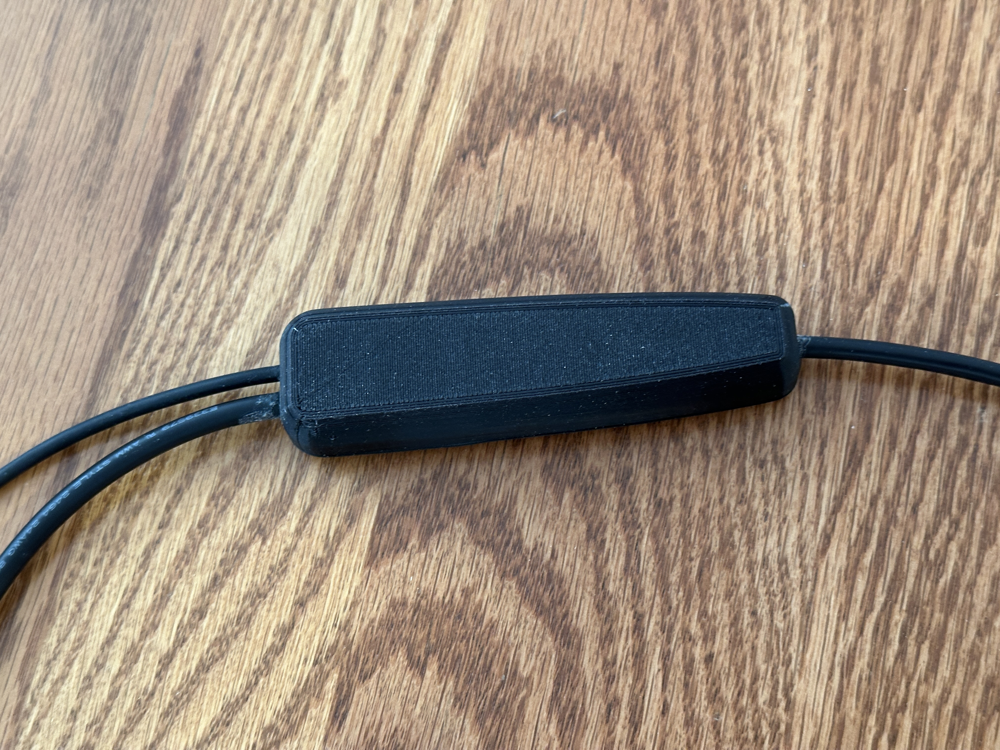
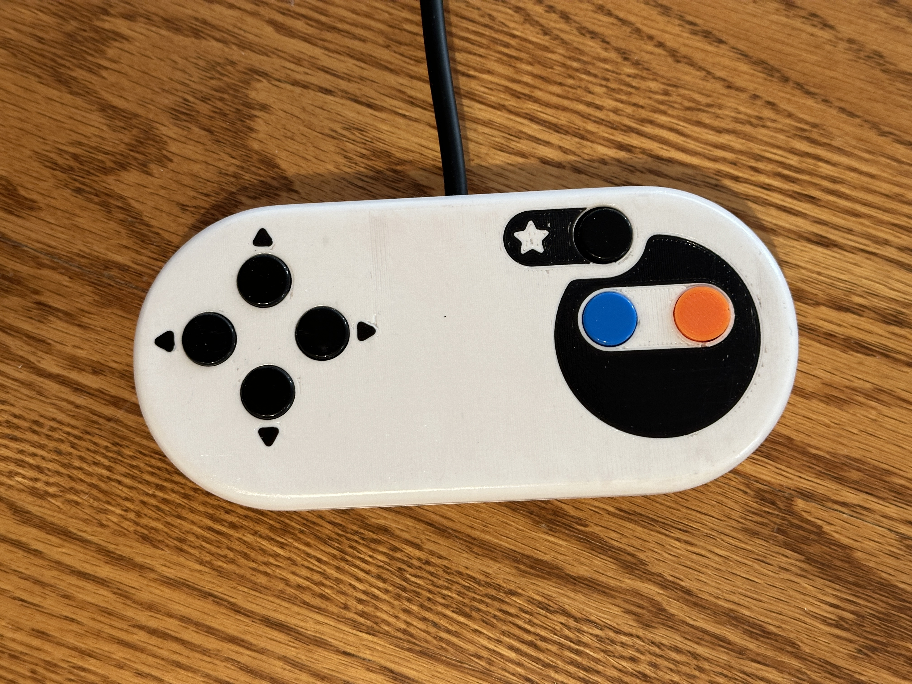
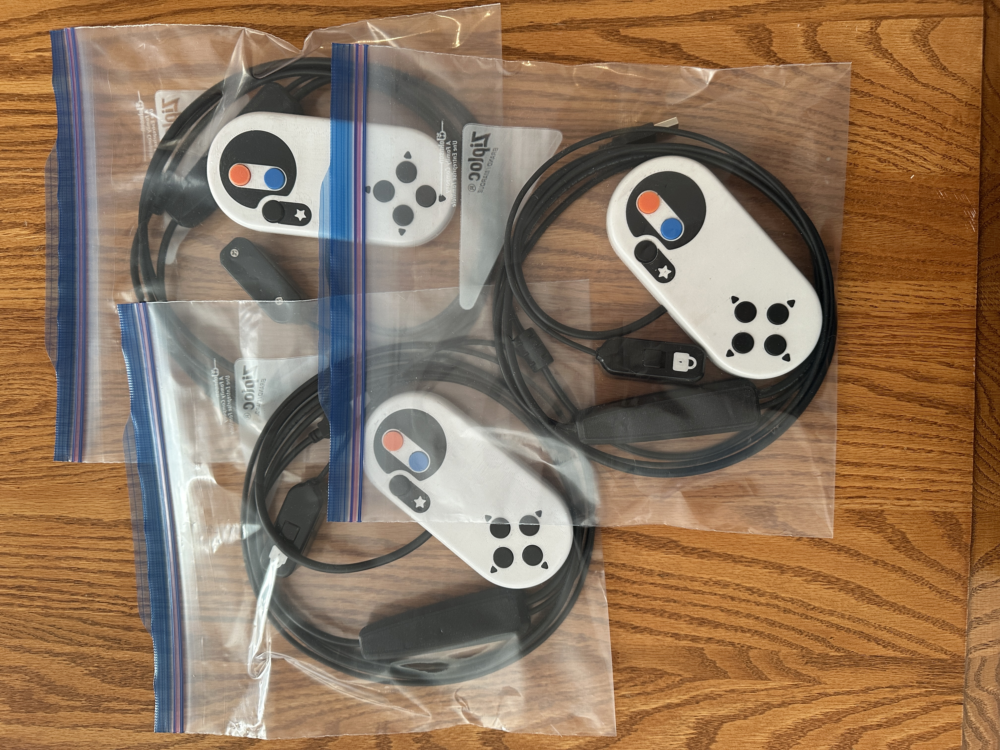

# LabSticks

The LabSticks project was born out of a need to address young participants in a local university study who were interacting with the traditional keyboard and mouse setup in ways that led to unwanted inputs and disruptions. These interruptions didn't just disrupt the researcher's work; they also jeopardized the accuracy of the study results.

Thus, the idea for LabSticks was conceived—a custom controller designed with the familiarity of classic "sticks", our affectionate term for gaming controllers. The controller's design, which is not only more intuitive for the young participants but also includes an essential disable feature for use between testing rounds, provides researchers the assurance of undisturbed work. It's a tool that bridges the gap between ergonomics and functionality.

LabSticks leverages the flexibility of GMK firmware and easily accessible components, with the design centered around a custom printed circuit board (PCB) and a 3D printed ergonomic enclosure.

## Design

The controller, designed with the dimensions of a classic gaming controller in mind, houses the necessary components to facilitate inputs for testing software. For more detail check  [CAD Files](https://github.com/JDSiemens/LabSticks/tree/main/CAD%20Files).

The PCB, custom designed and printed, houses the ATmega32u4 microcontroller and the switches. [Also available in CAD Files](https://github.com/JDSiemens/LabSticks/tree/main/CAD%20Files).

The casing for the controller is 3D printed, as is the case for the disable toggle controller. The controller features seven buttons, each corresponding to a specific input.

## Keymaps

The keymaps required are as follows:

|FUNCTION	|GMK MAP	| PROMICRO PIN |
|---------------|---------------|--------------|
| UP |	KC_KP_8 |	2 |
| RIGHT |	KC_KP_6	| 3 |
| DOWN	| KC_KP_2	| 5 |
| LEFT	| KC_KP_4	| 4 |
| BLUE BUTTON	| KC_MS_BTN1	| A1 |
| ORANGE BUTTON	| KC_MS_BTN2	| A0 |
| START	| KC_ENT	| A2 |
| DISABLE	| TG(BLANK_LAYER)	| A3 |

## Final Assembly 

The Y junction was printed in high shore hardness TPU, at 30% infill for a combination of strength, and flexibility.

The final controller was inlayed with direction arrows, a “star” Start button indicator, and SNES inspired graphic around the “blue” and “orange” buttons.  Final controller was sanded down to 1500grit, and then acetone vapour polished, for a combination of added strength + a tactile feel closer to that of an injection moulded controller.

As prescribed by the study itself, BLUE and ORANGE must be used.  As there was no orange button available, a 3D printed replacement was fitted.  (STL available)

# GMK Firmware

[Latest GMK Firmware available here](https://github.com/JDSiemens/LabSticks/tree/98ac673fcb640c3302baf90015d64262e01fac7c/labsticks)

## Bill of Materials (BOM)

| Quantity | Part | Description |
|---------|---------------|------------------------------|
| 1 | ATmega32u4 | Microcontroller for handling inputs |
| 7 | Gikfun AE1027 microswitches | Used for input buttons |
| 1 | Toggle Switch | For enabling/disabling the controller (e.g., Miniature SPDT slide switch, or similar) |
| 1 | Custom Printed PCB | Houses the microcontroller and the switches |
| 1 | Multi-Conductor Cable | 6-strand, colour-coded cable for wiring (e.g., Alpha Wire 3583/6C multi-conductor cable, or similar) |
| 1 | Micro USB Connector with Breakout Board | Connection to the microcontroller |
| 1 | USB A Connector with Breakout Board | Connection to the host machine |
| 1 | Zip Tie | Strain relief |
| 1 | 3D Printed Enclosure | Top and bottom casing for the controller |
| 1 | 3D Printed Enclosure | Case for the disable toggle controller |
| 1 | Resin 3D Printed Button  | Orange color is needed |
| 4 | M3 Heatset Inserts | For fastening the casing |
| 4 | M3x12 Flat Top Tapered Screws | For fastening the casing |

## Final Deliverables

These were the final shows of the controllers w/ their custom cable lengths, button mappings, and button colours.

## Serial Number Tracking

Serial numbers have been engraved on the rear shell of each input device. When building your own, please follow the established serial number convention:

4 Digit YEAR
4 Digit DESCRIPTIVE code
3 Digit Unique ID

| Example Serial Number ID | Description | | | |
|-------------------------|-------------|--|--|--|
| Example:                | 2023-B7S1-001 |
| Serial # Component:     | "2023" | "B7" | "S1" | "001" |
| Component Description:  | Mfg Year   | Buttons | Switches | Unique Count ID |

Please submit any serial numbers to this Git, to have them added to the master registry below

| Ledger |||||
|---------------|------------------|----------------------------|---------------------------|-----------------|
| Serial # | Count Registered | Description| Git Files  | Registry Date |
| 2023-B7S1-XXX | 001-005 | SNES Style Research Controller | [Main Link to Hardware CAD files for this LabStick type] (https://github.com/JDSiemens/LabSticks/tree/main/CAD%20Files) | 9/2023 |

## Contributing

We welcome contributions to this project. Before contributing, please read our [Contributing Guidelines](contributing.md).

## License

This project is licensed under MIT Licence. See [LICENSE](LICENSE) for details.
